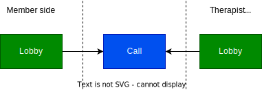
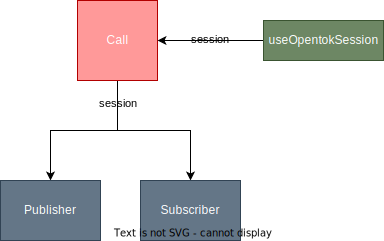
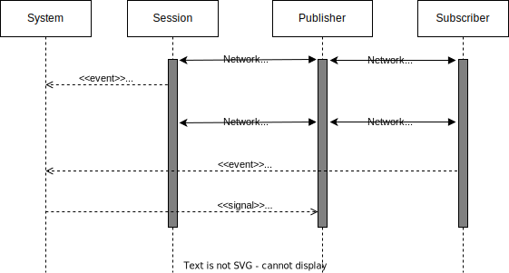

# opentok-react

Proof of concept (PoC) intended to demonstrate call stability. This app leverages the Opentok library using React.

Please note that this project was scaffolded using Vite.

## PoC Intention

We want to make sure we can hold a Therapist-to-Member call on the web that is supported by the Opentok library only.

Even though this is just proof-of-concept, the components developed in this project are intended to be as close as possible as the ones integrated into the HelloSelf codebase (less the styling and responsiveness). The logic flow is a simplification of what we want to achieve but a close one nevertheless (the Lobby-Call architecture.)

The Opentok documentation showing a simple code supporting a two-way call can be accesed here: [https://tokbox.com/developer/tutorials/web/basic-video-chat/](https://tokbox.com/developer/tutorials/web/basic-video-chat/)

## Installation steps

Run the following scripts to run locally:

- yarn
- yarn dev

Once the local server is up and running, we can access the app at [http://localhost:5173/opentok-react/](http://localhost:5173/opentok-react/) from there, we are presented with two links: one for the Member and the Therapist experience each. (There may be more links available for extra tests).

## Making sense out of the code

There are two important concepts behind the code: The Lobby and the Call itself.

The Member experience is separated from the Therapist one. While they are practically the same, this highlights the intention of having two separate entities that might or might not present different features.

This also means that we are expecting to have two browser windows opened simultaneously to simulate a two-way call: one for the therapist and one for the member.

The diagram below depicts the idea of having the Member & Therapist entities joining a Lobby each before jumping into a Call:

The Lobby is represented by the [GetMediaLobby](src/lib/GetMediaLobby.tsx) component.

The [Therapist](src/lib/Therapist.tsx) and the [Member](src/lib/Member.tsx) components both act as Wrappers of [Call](src/lib/Call.tsx) which is the component handling the Call feed.

## GetMediaLobby

This component's main objectives are:

- Connect to the session using opentok's api. This is useful to check if connecting to the session is possible before jumping into the Call.
- Show a live video feed using the default camera. If a different camera device is selected, the video feed should reflect the change.
- Allow the user to select the devices supporting the video and microphone inputs and the speaker output. If any if the devices is not selected, then the user is not allowed to progress to the Call (this is not enforced at the moment).

## Call component

The heart of the PoC. Here we deal with three entities required to execute a successful call: The `Session`, the `Publisher` and the `Subscriber`.

Simply put:

- The Session is encapsulated by the [useOpentokSession](./src/lib/hooks/useOpentokSession.tsx) hook. It instantiates and connects to an opentok session by using an `apiKey`, a `token` and a `sessionId`. This hooks makes the session object available to the rest of the world.
- The [Publisher](./src/lib/Publisher.tsx) is our own live video and audio **stream** feed. We start publishing the second we start a call.
- The [Subscriber](./src/lib/Subscriber.tsx) is someone else's **stream**. When some else starts streaming, the session knows about it and we show that feed on-screen.

Both the Publisher and the Subscriber need a DOM element to exist, that's why we can see them onscreen.

There are some important features regarding these entities:

- The [Call](./src/lib/Call.tsx) component then just composes the entities listed above to create a successful call:
  1. When mounted, the `useOpentokSession` connects to an opentok session and makes the session object available to the Publisher and Subscriber (they receive it via props).
  2. The `useOpentokSession` hook gets the opentok's credential by using the mock api we have described previously. It also polls this endpoint as requested by the documentation.
  3. Once the session object is available, the publisher uses it to start streaming its own video and audio feed
  4. Once the session object is available, the subscriber uses it to check if there's any stream available and if so, it displays the feed on the DOM
  5. Each component takes care of executing cleaning up logic on unmount so when we navigate back or refresh the page that routes to the Call component, it works as expected.

Below is a diagram aiming to depict the anatomy of the Call component:

`The OpenTok (Vonage) official documentation can always be used to get information on the Session, Publisher and Subscriber APIs.`

## Mocking the Backend (APIs)

For the PoC, we needed to create a temporary API that would dub as the real one to be used in the HS platform. It is based in the specification for the `/call-v2/room/{roomId}` endpoint stated in the docs [here](https://github.com/HelloSelf/HelloSelfCallV2#request). In this PoC, we refer to this API as the "mock" api.

The mock api is used to get the opentok's credentials (sessionId and tokenId) required to connect to the OT's session but it is also used for polling (as specified in the docs). The mock api that we are using here is `getOpentokCredentials` and can be accessed [here](src/api/callApi.ts). Under the hood, this call is executing a get request to an endpoint hosted at https://opentok-node.onrender.com.

**In order to get the mock api working** we weed to update the opentok's credentials that are served by the mock api. The credentials are stored statically at the `opentok.config.js` file [here](https://github.com/israel-hs/opentok-node/blob/main/opentok.config.js) and we should replace them using the testing credentials made available by opentok's docs [here](https://tokbox.com/developer/quickstart/). These changes need to be commited to the `main` branch of the https://github.com/israel-hs/opentok-node repository.

Once that is done, we need to deploy the changes manually in the server hosted at the [render.com](https://render.com/) platform. At the moment, it is only Israel Romero the one with access and hence the only one who can deploy.

## Unhappy paths

There are many things that could go wrong while trying to get a call between two parties going. Most of these haven't been account for. These paths include:

While at the Lobby:

1. Explicitly denying access to the camera or microphone at the lobby (we display a message/overlay at the lobby when this happens, but probably we need to cover more scenarios)
1. Disconnecting the default camera once it has already been recognised as the one to be used
1. Not being able to connect to the opentok session

While at the Call:

1. One of the parties disables the camera mid-call (think of closing your laptop, disconnecting an external camera)
1. One of the parties' network suddenly disconnects for a short period of time (we were already tackling this scenario at the PoC, please have a look at comments in the Call component)
1. One of the parties' networks disconnects for a long period of time (say than 10 secs)
1. **What happens if any of the parties disconnects from the call to never come back??** (important as the therapist is the only one who can close a call/room, what about the member?)
1. One of the parties' network drops in quality but doesn't really disconnect. What should happen with the call's streaming quality? Do we do something about it? Do we trust on the opentok library to deal with it?

## What needs to be done moving forward

We list the pending challenges that need solving moving forward:

- Coverage for the main browsers (Chrome, Firefox, Edge and Safari) needs to further testing. The issue whereby the `enumerateDevices` doesn't return any audio output devices (speakers) in Firefox has been fixed by Thomas Truong but the solution exists on the HS Member codebase only. Browser coverage for any APIs can be checked here: [https://caniuse.com/?search=enumerateDevices](https://caniuse.com/?search=enumerateDevices).

- As mentioned at the unhappy paths, there are many scenarios why the user may have denied access to camera/mic. It could be due to explicitly denying it by error, or browser/OS restrictions. Accounting for these scenarios improves the UI. There's a medium [article](https://medium.com/joinglimpse/how-to-build-beautiful-camera-microphone-permission-checking-for-websites-e6a08415fa76) tackling this issue by incorporating the [mic-check](https://github.com/helenamerk/mic-check) open-source library. We even tried incorporating an example into this PoC through the [MediaOnBoardingDialog](./src/lib/MediaOnboardingDialog.tsx) component which is a copy-paste of an example at the `mic-check` library. There's a link to this component at the same place where we dsiplay the Lobby and Therapist links. Worth having a look.

- While the end-to-end call works, connectivity issues haven't been accounted for in this PoC, and therefore they are encouraged to be tested and catered for in here before testing them in the HelloSelf platform.

- While we are including the `screenshare` as part of this PoC using the `web-components` library, we haven't been able to clean/destroy the stream related to it and thus we could be dealing with memory leak.

- Event logging needs to be accounted for. A list of the events that we are already logging in the backend for the Member and Expert platforms should be compared against the events we are logging (to the console) already. The full list of events for each of the entities can be found at the utils [here](src/lib/utils.ts).

- Alan requested incorporating the following features:

  1. The call should display more than one stream. Due to past security issues, we'd like to show any person (stream) that connects to the session reflected in the UI. This means we want to have the Subscriber adapt its style to show all streams connected (maybe in a grid fashion).
  1. We should allow a background filter into the call. Check Vonage's documentation to achieve this.

- To test bad connectivity, Alan suggested using [Charles Proxy](https://www.charlesproxy.com/documentation/proxying/throttling/).

## GitHub pages

This PoC can be accessed via GitHub pages at [https://israel-hs.github.io/opentok-react/](https://israel-hs.github.io/opentok-react/).

In order to publish any new development, just run the deploy script by executing `yarn deploy`. This will use local changes to update the artifacts in the GitHub page configuration related to this codebase.

## Troubleshooting

As this project is hardcoding the `token` and `sessionId` required to connect to a sesssion, and as these entities can exipre, we need to manually update them at our codebase. The `apikey`, along with the `token` and `sessionId` can be copy-pasted from a OpenTok example here: [https://tokbox.com/developer/quickstart/](https://tokbox.com/developer/quickstart/) (see _Step 1 of 5: Authentication_ section to copy the info).

## Reconnnection

Having a robust, stable re-connection mechanism after a network connection drops in the middle of the call is one of the most sensible parts of this app. We ultimately want to bring stability to the call experience.

When we successfully connect to an opentok session and get our publisher and subscriber streams going, all these entities keep track of the connection being alive by receiving heartbeats to and fro the server. The moment the connection is lost, the entities no longer receive the heartbeats and thus know there's something wrong. This is where **events** are started to beign triggered by the Session, Publisher and Subscriber at different times, for different reasons. But we want to concentrate in a few at the moment:

So, at the moment our network connection is drop in the middle of a call:

<u>From the point of view of the party that loses connection</u>:

1. Session triggers a `reconnecting` event (which can be useful to update the UI to show an icon placeholder the way Google Meet does it when a connection is dropped)
1. Subscriber triggers a `disconnected` event (we don't act on this one, we list it only for reference)
1. if we reconnect to the call fairly quick (~10 secs):

   - Session triggers a `reconnected` event (meaning the session is still connected)
   - Subsciber triggers a `destroyed` event (we act upon this as we need the other party that never disconnected to re-publish its stream by triggering a `signal:republish`)

1. if we reconnect to the call after some longer time (>15 secs)

   - Session triggers a `destroyed` event (we need to confirm this), meaning that even if the session object is not null, the session is disconnected, and thus the logic needs adjusting
   - **Need to investigate further and define what to do in this scenario**

The sequence diagram below aims to depict what happens behind the scenes with the components when we lose connection:

At the moment the PoC successfully and automatically reconnects to the call after a network connection is lost **as long as we reconnect to the call between 10-25 secs**, which means that we do not lose the active connection to the opentok session.

Please have a look at the comments added to:

1. `signal:republish` event listener to the [Publisher](./src/lib/Publisher.tsx)
1. `destroyed` event listener to the [Subscriber](./src/lib/Subscriber.tsx) components

**Remember**: We haven't tacled the unhappy path were we lose connection to the Opentok session by losing network connectivity for a longer period of time\*\* (say more that 20 secs)

## Removed from this branch

1. The `inputs-select` element (from opentok's [web-components](https://github.com/opentok/web-components/tree/main/inputs-select) demo repo) was removed from this branch as it is unlikely to be used on our final implementation. It can still be accessed at the `refactor/call` branch [here](https://github.com/israel-hs/opentok-react/blob/refactor/call/src/lib/GetMediaLobby.tsx)
